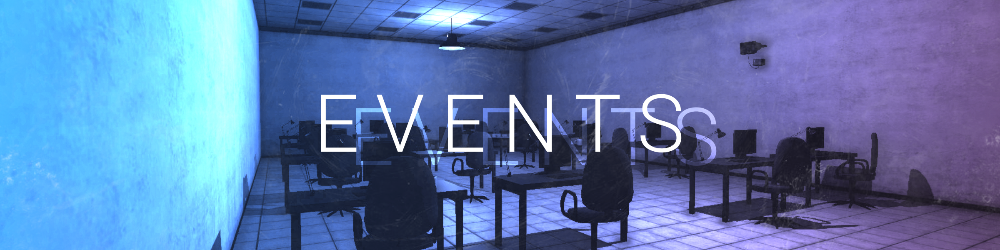

?> Please feel free to suggest new events or variations of the current ones, we're always open to making things more fun and interesting for the community!

## Smol SCPs
An average round where all SCP classes are shrunk to less than half their original size. This makes hitboxes a little more difficult to aim for, but it generally makes for some really interesting and entertaining rounds. There are no clear winners during these rounds, just fun gameplay.

## Hide & Seek Infection
Entrance Zone is locked down, no players can leave.

All but one player is spawned as smaller Class D, they are given one minute to find a hiding place. A singular SCP-049 is spawned and teleported to Entrance once the timer is up, they begin their hunt for new Seekers.

## Nut Galore
A quarter of the players are spawned as SCP-173, while the remaining 3/4 are spawned as Class D and Scientists.

## Undecided Events

### Peanut Run
These would be very fast paced rounds. 
All players are spawned as SCP-173 and warhead detonation is started immediately. Players must find their way to the surface before detonation occurs. Only those that survive are the winners.
