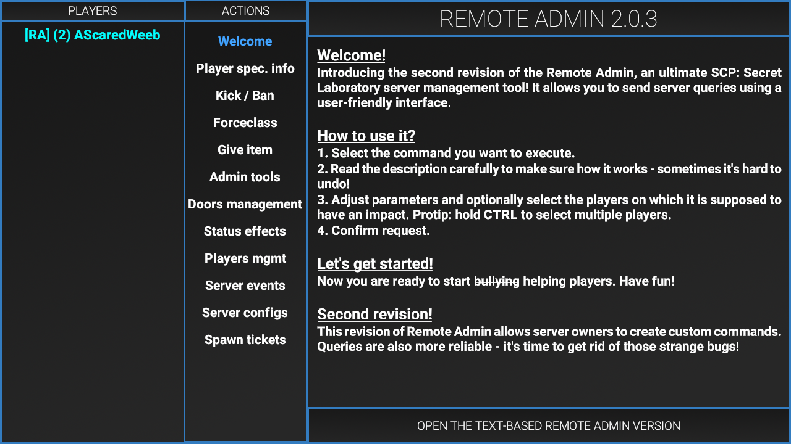
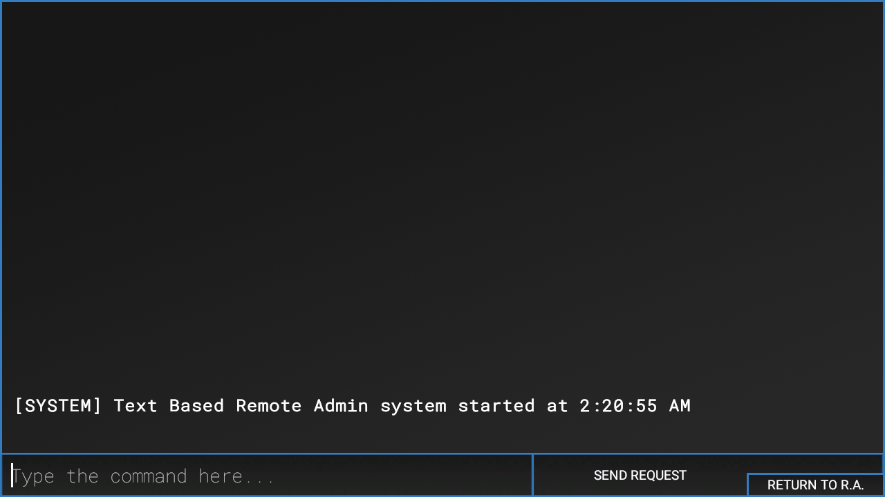
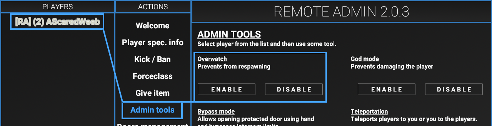
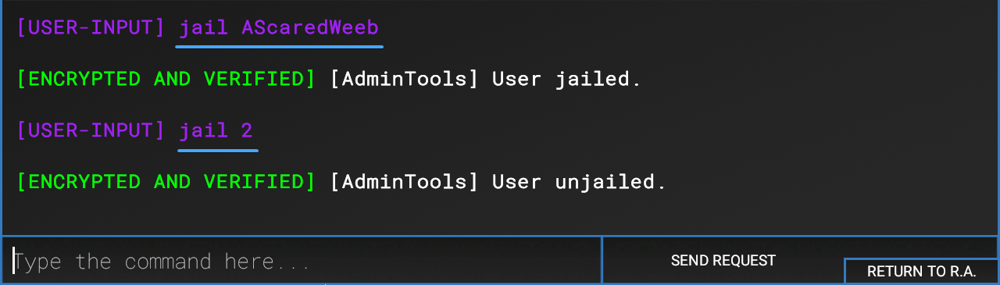
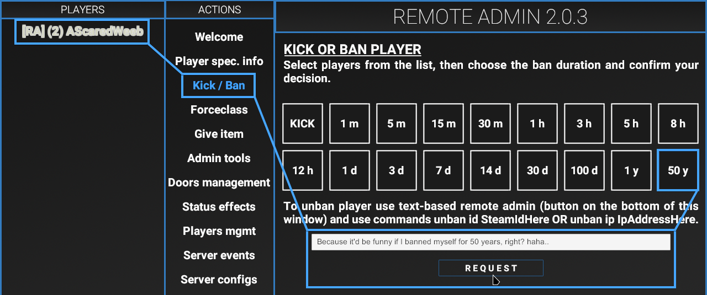

# Staff Resources

## Roles & Perms
Base roles are what define the permissions a member gets, vanilla and EXILED included.
Within the SL Server, we have four different base staff roles, each staff member gets their own role that has it's own badge but no one user gets their own base role, only inherit from them.

Here's a rundown of all the base roles, keep in mind roles inherit permissions from all lower roles.

### <font color={{col-orange}}>Trial Moderator</font>
The first role a new staff member will ever get. This role is a limited variation of Moderator, with the intention of making sure the member is a good fit to the team as well as teach them how we handle things and get them used to the Remote Admin panel.

Permissions:
- Banning Short Term
- Broadcasting Private Messages
- Viewing & Using AdminChat
- Kicking Players
- Jailing Players
- Entering Overwatch Mode

### <font color={{col-yellow}}>Moderator</font>
The main goal of a Moderator is to maintain the integrity of the server regarding rule breakers and hackers.

Permissions:
- Banning Medium Term
- Broadcasting All Channels
- Forceclassing Themselves
- View Hidden Badges

### <font color={{col-blue}}>Trial Admin</font>
A limited variation of the Admin role, with the intention to ensure the member understands admin related Remote Admin commands, how events are handled, and that they won't abuse.

Permissions:
- Banning Long Term
- AFKImmunity
- View Hidden Global Badges
- Admin Tools Broadcast
- Ghosting Players
- Running Events Commands

### <font color={{col-purple}}>Admin</font>
The main goal of an Admin is to maintain integrity of the server where a Moderator's permissions fall a little short, as well as running events for the community and handling some server management stuff like applications and documentation.

Permissions:
- Cleanup Items/Ragdolls
- C.A.S.S.I.E. Announcer
- Apply Status Effects
- Forceclassing without Restriction
- Giving Items
- Manage Warhead Events
- Manage Respawn Events
- Manage Round Events
- Manage Facility
- Manage Players
- View Gameplay Data
- Noclip

## Demotions & Promotions
**<font color={{col-orange}}>Regarding Demotions</font>**

If you break *any* server rules, you will be given a warning. A warning given by any role above yours counts as an official warning.

After one warning, another rule break will result in a demotion. Following a demotion, you will not qualify for a promotion for a month.

In the case of a demotion, staff members may be asked to give their input as to the member in question and their behavior, to avoid bias. We all have a say in this.

**<font color={{col-green}}>Regarding Promotions</font>**

In order to be promoted, you must have had at least a month in within your current role, with no warnings or demotions.
It requires an in depth understanding of the Remote Admin Panel and the commands associated with them, as well as a reasonable amount of time playing on the server and amount of properly handled warns/bans.

Attempting to tryhard and warn/ban your way to a promotion will not benefit you in your promotion, and could even harm your chances.

Promotions will be handled mostly by Admin staff and above, though Moderators may be asked to weigh in on some situations, especially regarding recommendations.

## Intro to Remote Admin

The Remote Admin (RA) Panel is a mildly convoluted but very powerful tool. This is where basically all of your staff based actions will take place. Please take the time to read it's welcome section, and perhaps even this equally as [convoluted guide](https://en.scpslgame.com/index.php?title=Remote_Admin), it does cover most of the vanilla RA functionality.

Please ensure that you've got the correct player selected before executing commands, we wouldn't want you banning another player on accident... or yourself... for 50 years...

To note, some of the most important features and pages are
- Kick / Ban
- Admin Tools
- Text Based RA

### Text Based Remote Admin

Not all staff actions can be executed with a fancy GUI interface, sometimes you've gotta get deep into commands, but honestly it's not that difficult, over the next few sections we'll be getting into those commands and how to run them.

## Overwatch Mode

To enable Overwatch Mode, open the RA Panel, go to "Admin Tools", ensure you have the correct player(s) selected and click "Enable" under "Overwatch".

By putting yourself into Overwatch Mode, it ensures that you will not be respawned with NTF or Chaos spawn waves, and during the start of rounds it will automatically switch you to Spectator so you may watch over the game.

This is really helpful when lots of players are on and you need to keep track of multiples or people who have broken rules in the past. You will be in Spectator voice chat while in Overwatch mode, so it allows you to easily listen for people mentioning team killing or other offenses.

## Jailing Players

This is the absolute best way to warn players, if a player is reported or witnessed breaking a rule, jail both yourself and them and speak with them verbally. Banning is extremely straight forward. Simply find their name or numberic ID (preferably ID), and switch to the Text Based RA Panel, then enter the command:
```
jail <name|id>
```

Once you are done warning them run the same command again to unjail them. This will restore their class, inventory, and position within the facility.

?> In the event that you can't give a verbal warning for some reason, Private Broadcasts can substitute, though verbal warnings are *ALWAYS* preferred.

## Broadcasting Messages
There are three types of broadcasts you can run, **global**, **AdminChat specific**, or **player specific**.

### Global Broadcasts
Sends a global broadcast to the entire server. Best to use when addressing the entire server, often regarding events or server restarts.
```
bc <duration> <message>
```

### AdminChat Broadcasts
Sends a broadcast to all staff members on the server. Useful if you need to easily get ahold of a staff member due to an immediate issue, but pinging on Discord works just as well.
```
abc <duration> <message>
```

### Private Broadcasts
Sends a broadcast to a specific player only.
```
pbc <playerID> <duration> <message>
```


## Banning Players

As detailed in [Handling Rulebreaks](staff-guidelines.md?id=handling-rulebreakers), once a player has been warned once for a rule break, if they break a rule again, that warrants a ban. So in order to ban someone, head to the "Kick / Ban" section, make sure the correct player(s) is/are selected, select the length of the ban, write in the reason and click "Request". It should broadcast to the whole server that the player was banned.

!> There have been some cases in which you can ban yourself, please be careful. Hopefully this will be sorted out by time we move to EXILED, but regardless, be careful.

### Unbanning a Player
In order to unban a player, you can either use their SteamID or their IP Address, SteamID seems to be the most reliable and will be output reliably within the `#game-log` channel on Discord.

This feature is kind of hidden away, and by that I mean it's literally explained right under the ban length options but I failed to see it. I've been under the impression the only way to unban would be to alter config, but apparently it's possible through a Text Based RA command.

```
  unban id <steamID64>
  unban ip <ipAddress>
```

## Event Commands
!> No information on Event Commands just yet
